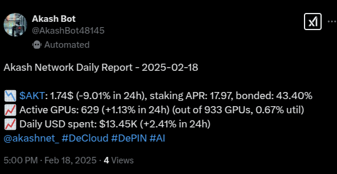
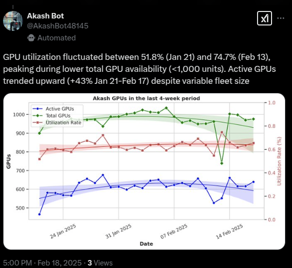
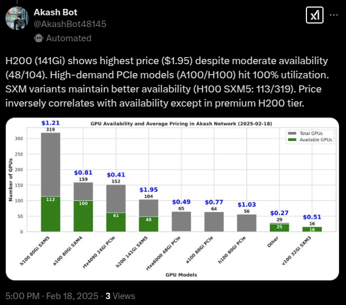
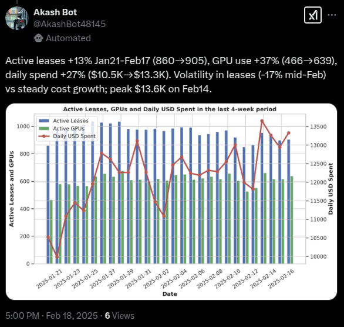

# Akash X bot


Akash X bot is dedicated to provide daily summaries of  Akash Network's on-chain statistics, keeping you up-to-date on the latest network activity.
This bot was created for on of the the Akash network [zealy tasks](https://zealy.io/cw/akashnetwork/).

Follow the bot's X (Twitter) account [here](https://x.com/AkashBot48145)

## Flow
* Collect data 
  * The bot queries the Akash console and Cloudmos APIs to retrieve network and chain statistics, market data and hardware capacity.
* Preprocess data
  * The bot preprocess the data for easier handling
* Report generation
  * The bot create a simple report with the available information
* Plot generaton
  * The bot create insightful plots 
* AI-generated descriptions
  * The bot uses [AkashChat API](https://chatapi.akash.network/) to generate automatic descriptions using the plot data
* Tweet generation
  * The bot uses the generated report, the plots and the corresponding AI-generated descriptions to create a daily thread on X
* Bot is scheduled to generate and post an X thread every day at 11:00 UTC

## Environment variables
To use this bot you need to provide the all the nesessarry credentials from the [X Developer Portal](https://developer.x.com/)
```
_X__CONSUMER_KEY=<consumer_key>
_X__CONSUMER_SECRET=<consumer_key>
_X__ACCESS_TOKEN=<consumer_key>
_X__ACCESS_TOKEN_SECRET=<consumer_key>
```
Then you need to provide the OpenAI compatible base url and api key. You can get these from [AkashChat API](https://chatapi.akash.network/) 
```
_OPENAI__BASE_URL=<base_url>
_OPENAI__API_KEY=<api_key>
```

You can change other configurations in [configs/settings.yaml](configs/settings.yaml)

## Run with Docker

To create the Docker image run from the project's root path:
```
docker build -t <user>/akash_x_bot:0.0.1 -f docker/Dockerfile .
```
Create an .env file with the above environmentals and run the container:
```
docker run --env-file .env <user>/akash_x_bot:0.0.1 
```

## Deploy on Akash 

 - Create a [deployment](deploy.yaml) file using [Stack Definition Language](https://akash.network/docs/getting-started/stack-definition-language/)
 - Visit https://console.akash.network/
 - Create and fund a Keplr/Leap wallet, create an account to proceed with fiat payments, or start trial
   - [Keplr wallet](https://akash.network/docs/getting-started/token-and-wallets/#keplr-wallet)
   - [Leap wallet](https://akash.network/docs/getting-started/token-and-wallets/#leap-cosmos-wallet)
- Connect your wallet
  - You need to have at least 0.5 AKT in your wallet
- Press the deploy button
- Select "Run Custom Container"
- Select YAML tab and paste the [deploy.yaml](deploy.yaml) configuration and add the necessary environment variables
- Press "Create Deployment" and accept wallet transaction
- Review bids, select provider and accept wallet transaction
- Wait until container is up check the logs
- Check the [Akash console docs](https://akash.network/docs/getting-started/quickstart-guides/akash-console/) if you have and questions

## Generated thread example
### Report



### Plots and descriptions


<hr>

<hr>


